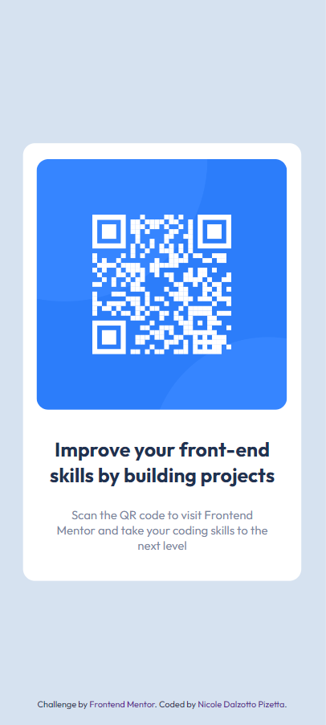

# QR code component solution - Frontend Mentor Challenge

BR: Esta é uma solução para o [QR code component challenge on Frontend Mentor](https://www.frontendmentor.io/challenges/qr-code-component-iux_sIO_H). Os desafios do Frontend Mentor ajudam você a melhorar suas habilidades de código criando projetos realistas.
O desafio é construir esse componente de código QR e deixá-lo o mais próximo possível do design.

EN: This is a solution to the [QR code component challenge on Frontend Mentor](https://www.frontendmentor.io/challenges/qr-code-component-iux_sIO_H). Frontend Mentor challenges help you improve your coding skills by building realistic projects. 
The challenge is to build out this QR code component and get it looking as close to the design as possible.

## 🌸 Screenshots
#### Desktop

#### Mobile - iPhoneSE

#### Mobile - Samsung S20 Ultra

## 🌸 Tecnologias usadas | Technologies used
- Semantic HTML5 markup
- CSS custom properties
- Flexbox
- CSS Grid

## 🌸 O que aprendi | What I learned
BR: Esse foi meu primeiro desafio sem auxílio de aulas de cursos ou vídeos, sei que pode parecer simples, mas é um importante passo na aprendizagem autodidata. Celebrar os primeiros e pequenos passos é muito importante. Usei esse desafio para treinar minhas habilidades aprendidas nos cursos. Foi muito útil praticar mais sobre flexbox e pensar na lógica do processo de construção de código.
Percebi como é difícil, no início, codar com flexbox de maneira "rápida". Não há atalho, apenas prática, prática, prática de novo e MAIS prática. Isso realmente me motivou a focar mais nisso. 💖

EN: This was my first challenge without the help of courses or videos, I know it may seem simple, but it is an important step in self-taught learning. Celebrating the first and small steps is very important. I used this challenge to train my skills learned in the courses. It was really helpful to practice more on flexbox and think about the logic of the code building process.
I realized how difficult it is, at first, to code with flexbox in a "fast" way. There is no shortcut, just practice, practice, practice again, and MORE practice. It really motivated me to focus more on it. 💖

## 🌸 Recursos úteis | Useful resources
BR: [Qual a melhor forma de centralizar um elemento vertical e horizontalmente?](https://pt.stackoverflow.com/questions/2817/qual-a-melhor-forma-de-centralizar-um-elemento-vertical-e-horizontalmente)   
EN: [How to Center an Image in HTML & CSS](https://blog.hubspot.com/website/center-an-image-in-html#:~:text=Step%201%3A%20Wrap%20the%20image,to%20a%20fixed%20length%20value.)

## 🌸 Autor | Author
- GitHub - [@NicoleDPizetta](https://github.com/NicoleDPizetta)
- Frontend Mentor - [@NicoleDPizetta](https://www.frontendmentor.io/profile/NicoleDPizetta)
- LinkedIn - [@nicoledpizetta](https://www.linkedin.com/in/nicoledpizetta/)

## 🌸 Agradecimentos | Acknowledgments
BR: Agradeço ao meu marido [@VictorPz](https://github.com/VictorPz) por me ajudar e me encorajar tanto. Estamos muito orgulhosos do resultado. 🥰

EN: Thanks to my husband [@VictorPz](https://github.com/VictorPz) for helped me and provides so much encouragement to me. We are very proud of the result. 🥰

---------------

### 
💖 Obrigada por ler até aqui | Thanks for reading this far 💖
 
